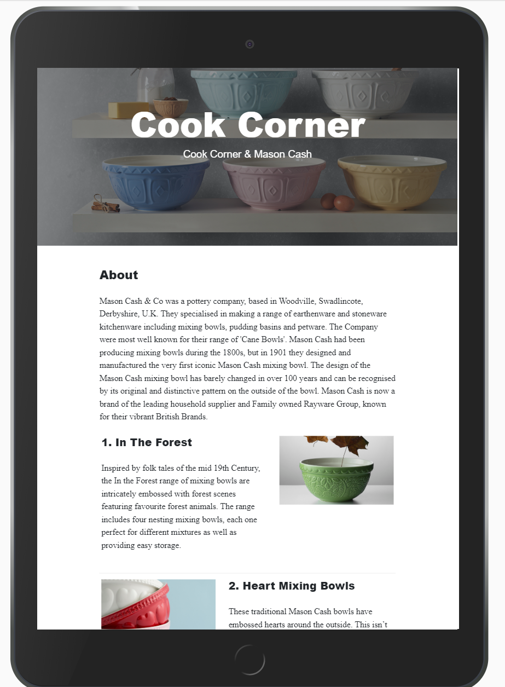
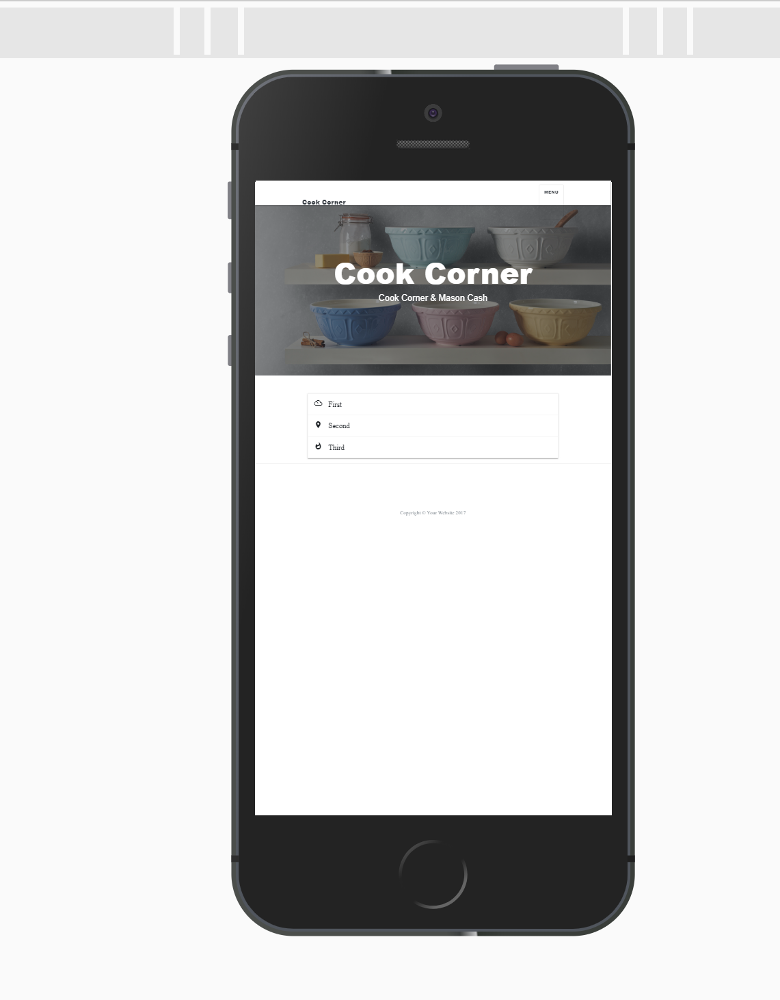
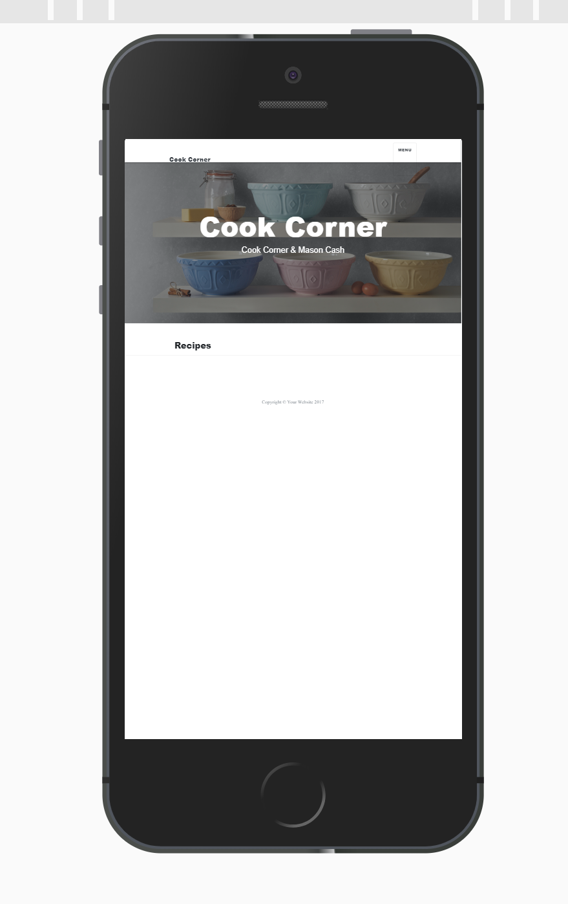

## Cook Corner
A dynamic website where keen cooks can post recipes and exchange recipe ideas with other cooks.  This website celebrates the tradition of great British craftsmanship and British cooking. 
Mason Cash originated in a pottery operating at Church Gresley in the heart of the English ceramic industry in 1800.
Two hundred years later, 
>mixing practicality with elegance
>is the mantra for this distinctive brand.  
The website is a B2C emotion driven and appeals to the benefits of users by encouraging interaction and engagement through the exchange and addition of favourite recipes on the databse.  This website ideally is a logon and password encrypted one. However, that is left for me to implement later. My focus is on the CRUD functionality.
Bakeware, untensils and beautiful mixing bowls in various colours are available and ready to use by those who appreciate baking and cooking only with the finest!

This website features the iconic mixing bowls which are made from high quality, chip-resistant earthenware making them heavy enough to stand when mixing, yet light enough to hold comfortably in one arm.
The Oven and Bakeware comes in a range of sturdy and durable materials, from cane design bowls, gleaming white linea ovenware, oval and round to rectangular dishes; and finally the warmth of 
high quality terracotta and porous dishes which absorb moisture from the dough in order to produce a perfect crust every time.  The utensils has been designed for multi-functionality and comfort. Each piece is designed for multi-purpose functionality.  There are two innovative ranges in beechwood and stainless Steel range which ensures that all cooks needs are met.  The recipes are mainly British and in the spirit of well loved recipes old and new, tried and true; this website has been developed.

### UX

#### Ideal Customer:
* wants to buy the finest and iconic utensils and cookware. Enjoys cooking, experimenting.
* discover and share new ideas and recipes with keen cooks.

#### Visitors to this website are looking for:
* good quality bowls and utensils to use in recipes in the simple to use database provided and   can be easily be used to **Create, add, edit, update and delete** by the user.
* This website is a design for keen cooks to share recipes with others, by swapping ideas and     building up a collection.  
* Visitors have access to all the cook-ware they need via a link on the website to the finest     British cookware *Mason Cash*  [Masoncash](https://www.masoncash.co.uk/products/mixing-         bowls.html) when only the best will do.

#### This website is best for:

1. A new customer who wants to discover more about the useful implements and products that can    be found on the website and buy directly with companies who speicalise in Mason Cash via        links. This is in addition to promoting *Mason Cash* the Company, without having to leave      the site.
1. As a new visitor to the website I want to be able to navigate quickly and easkily.
1. As an interested visitor / customer I want to follow the activities of this website on          social media.
1. As an engaged visitor I want to return to the website and potentially purchase the              products and find out what is new.  A contact form and newsletter will be set up for this. 
1. Provide *User-stories adding to the website to encourage new and returning customers.

#### User Stories:
* As a customer, I want to be able to quickly look up the best products to use for my recipes,   so that I can order via the website from the company. I want to experiement with the           recipes: edit / delete / and update with my own versions of a particular recipe to try out on   friends and family. Talk about inspiring recipes with other keen cooks, and add my own         recipes  to the mix.  
  *Happy Customer - I. Cook

* I love the look and feel of the website. It is very appealing and harmoniously set up.  I can   find everything from the **Mason and Cash Company** here and I adore all things **British**.   The recipes are delicious. I relish trying them out, discussing with other likeminded members   on the site. I love adding recipies to the site as I discover new dishes. A fullfilling hobby!
  *Satisfied Customer - W. E. Bake
  
* I love social media and am looking forward to sharing my recipes with other keen bloggers and   social media aficionados! 
 *Love it - S. M. Butterfly
 
* What a pretty website! - so simple to use - I would like to be able to sort recipes and rate   them. Looking forward to receiving newsletters, trying all the mouthwatering dishes and         sharing with my friends. 
  *Can't wait  - B. Patience
  
### wireframes and Mockups:

#### Please follow paths to wireframes and mockups:

	1.	Format: .jpg)
			[https://github.com](https://ms-cook-corner/wireframes/wireframe(1).jpg)

	1.	
			[https://github.com](https://ms-cook-corner/wireframes/aboutipad.png)
			Format: 
	
	1. Format: 
			
			
	1.	[https://github.com](https//ms-cook-corner/wireframes/laptopimage%20(2).jpg)
			.jpg)
			
	1.	[https://github.com](https//ms-cook-corner/wireframes/recipe-mob.jpg)
			
			
	1.	[https://github.com](https//ms-cook-corner/wireframes/responsive.jpg)
			

http://github.com - automatic!
[GitHub](http://github.com)

## Features
The main feature I am showcasing in this website is the CRUD FUNCTIONALITY.

### Website

#### These consist of *Pages (to meet CRUD requirement - Create Read Update Delete)

#### Add recipe page (‘Create’, 'Read', 'Update', 'Delete')

This is how users add recipes to the database. It contains a simple HTML form to collect the recipe attributes we intend to store. 
The recipe collection in the database should have the same attributes, at the very least:

* A name
* A list of ingredients
* A method/list of preparation instructions
* Any other attributes necessary (the number of attributes does not need to be complex, since * * creating a new form element is just about copying and pasting others I create).
* List of recipes page **(‘Read’)*
* This page that displays the recipes in the database. (suggest this be on home page*).
* Edit a recipe page *(‘Update’)*
* A page to edit an existing recipe. This looks exactly the same as the add recipe page, except   this time, the form is pre-populated with values belonging to the recipe being edited.

Each recipe listed on the home page has an edit button that links to this page.
Delete link for each recipe *(‘Delete’)*
Each recipe list (on the home page) has a delete button that links to the *delete view*.

#### Deployment to Heroku
Kindly given to me via Anna Greaves(tutor)as I had trouble logging in with previous commands.

#### First we:
 npm install -g heroku

Then, to login, use the command:
heroku login -i * 

#### Clone the repository
Use Git to clone ms-cook-corner's source code to your local machine.

$ heroku git:clone 
Deploy changes
Make some changes to the code you just cloned and deploy them to Heroku using Git.

#### Deploy changes
Make some changes to the code you just cloned and deploy them to Heroku using Git.

$ git add .
$ git commit -am ""
$ git push heroku master

**Flask** I add all html pages so they can be rendered in *Flask to the Folder Name "templates"*.  Eventually we will be able to deploy this website on Heroku.  More on this later.
I have rendered the home, about and contact pages using flask and basic jinga template language to make it easier to type the paths and render each of the templates.
for example: we add inside the
 *"@href put {{ url_for('index') }}"*. We also do the same for *"about: {{ url_for('about') }}" and "contact: {{ url_for('contact') }} pages*. 
Essentially, Flask looks up our index() and about() views and injects the URL for it into the href.  All works as expected.
Another handy feature of Flask is the ability to detect any errors we might make such as *writing the url for 'home' instead of the url for 'index'*.  Home does not exist but index does and so indicates this error.

**Template Inheritance** Inherits code from other templates, creating a *base template and using  in a child template*.

**Passing Data from View to Template**  A very useful feature of using frameworks to actually set data on the server side and get it coming through to the client.
Benefits of using frameworks is the fact that we can actually get server-side code to provide the frontend with data. 
Example:- Go to *app.py*. Then add argument page_title="About"
to return serverside code to the frontend.
@app.route('/about')
def about():
    return render_template("about.html", page_title="About")

**Reducing repetition**  using the * notation* template tags for statements (not for expressions).
allowing us to use a *for loop* inside our HTML.  Standard Python *for loop* for number in list_of_numbers.
and then need to supply an  so that the templating language knows where the *for loop* stops.
Example:- 

    
{{ number }}
 


**The if template tag**
I use `if` statements inside my template. By using the example here:
  tag and the closing  tag. 
See this in action by going to *About* section of website.

**Getting Themes**  I have chosen the **Start bootstrap theme *Clean Blog* as featured in *CI lessons on Flask Framework*, for a multi-page website. 
I download the theme by copying the link then go to terminal and mkdir, then cd into it and wget the https://startbootstrap.com/themes/clean-blog/
I then style accordingly.   Unzip package with the *unzip gh-pages.zip* command.

## Existing Features - C.R.U.D. - allows users to add a recipe to store in database, by having them fill out the form.
*CREATE - Add the recipe by following the instructions.  Whole sections can be inserted by following the recipe page setup.
			    add recipe category, description, ingredinents, instructions.  MDB Atlas cleverly preserves the layout of the recipes 					that are being populated on the database.

READ -  	Read through and view all the recipes as a collection or view each recipe individually by clicking buttons. 

EDIT &amp;
UPDATE -  Click the button to edit the page and follow the instructions there.  Then click the UPDATE button 															to save changes.  Then return to Home page to add another recipe by clicking the CREATE BUTTON again.

DELETE		Press the delete button to undo changes.  
					
## Features Left to Implement
	1.	Search box to search recipes.
	1.  Login form with password so users sign in securely using the password to access the 		 				database.	
	1.  More links to other companies specialising in Mason Cash and other British products. 					Other specialised recipe sites 
			appropriate to this website.
	1.	Contact Form to sign up for newsletters.
	
	1.	A nice feature to be incorporated - be able to vote in different recipes and be more 					specific on recipe ingredients.

# Flask Chat project in my Recipe application
I originally cloned from my previous Flask Chat Project to build and create features in my new
Milestone 3 project. This chat application was written in *Flask*.  The application was downloaded from the libruaries using the pip3 install Flask from flask command.
The purpose of this project is to take data from a URL and store the information in a list, in this case sharing recipe ideas with authorised users who have signed up 
for this service.

## Technologies - a sample code to use in future:

>  *login snippet* - copied from https://github.com/joanms/recipe->database/blob/master/app.py:
>	if login_user:
            ### If the username is in the database, hash the password entered in the form and 								compare it with the hashed password in the database for that user
            		if bcrypt.hashpw(request.form['password'].encode('utf-8'), 			 			>login_user['password'].encode('utf-8')) == login_user['password'].encode('utf-8'):
                session['username'] = request.form['username']
                return redirect(url_for('index'))
        		### The user sees this message if the username and/or password are invalid
        				flash('Invalid username/password combination.')
    							return render_template('login.html')

### Libruaries / requirements

		* dnspython==1.16.0
		*Flask==1.1.1
		*itsdangerous==1.1.0
		*pymongo==3.10.1
		*Werkzeug==1.0.0
		*bison==0.1.2
		*click==7.1.1
		*Flask==1.1.1
		*Flask-PyMongo==2.3.0

### For CRUD FUNCTIONALITY 

Install flask: pip3 install flask
Create a python file: app.py
Install pynthon: pip3 dnspython

create instance of flask:   import os

In this section, you should mention all of the languages, frameworks, libraries, and any other tools that you have used to construct this project. For each, provide its name, a link to its official site and a short sentence of why it was used.

#### JQuery
The project uses JQuery to simplify DOM manipulation.

#### Testing
127.0.0.1 - - [20/Mar/2020 12:05:52] "GET /get_categories HTTP/1.1" 500 -
Encountered:
505 error indicates a temporary problem, and sometimes that problem is very temporary. A site might be getting overwhelmed with traffic, for example. So, refreshing the page is always worth a shot. Most browsers use the F5 key to refresh, and also provide a Refresh button somewhere on the address bar. It doesn’t fix the problem very often, but it takes just a second to try.

### Deployment
#### Cloning a repository to GitHub Desktop
I clone one of my Flask mini projects to deploy locally on GitHub desktop. 
On GitHub, I navigate to the main page of the repository.
Under my repository name, I click to clone my repository in Desktop. I follow the prompts in GitHub Desktop to complete the clone.  

(e.g. GitHub Pages or Heroku).
When trying to deploy my project to Heroku I hit a bug *- AttributeError
AttributeError: 'NoneType' object has no attribute 'categories'*
In particular, you should provide all details of the differences between the deployed version and the development version, if any, including:

To resolve this I ...

Different values for environment variables (Heroku Config Vars)?
Different configuration files?

#### Bugs
While I was trying to connect sensitive info from my flask app into a env.py file, I got the following error:

Traceback (most recent call last):
  File "/workspace/qc-metrics-analyser-4/app.py", line 7, in <module>
    import env
  File "/workspace/qc-metrics-analyser-4/env.py", line 6, in <module>
    os.environ.get["MONGO_URI"] = "mongodb+srv://seqMetRoot:dbconnection"
TypeError: 'method' object does not support item assignment

I managed to fix my problem with my env.py file. I was incorrectly using the get method. os.environ.get["MONGO_URI"] should have been os.environ["MONGO_URI"] .

Separate git branch?
In addition, if it is not obvious, you should also describe how to run your code locally.

Slack community - *various borrowed code snippets* See below credits. I often change them
                     when some of the code did not work for me.  However it did
                     lead me on to thinking again about seeing a line of code highlighted in an error I had been seeing, and checking at the bottom of my jinga codes for the errors.
                     This experience gave me more confidence to debug code.

## Credits
### Content
#### Cook Corner - Home page image - curtesy of Mason Cash:- 
 https://www.masoncash.co.uk/index.php/prodsecucts/mixing-bowls/colour-mix-mixing-bowls.html

#### About Page - all image credits curtesy of *Mason Cash*.  About main section copied from Wikipedia; https://en.wikipedia.org/wiki/Mason_Cash
*Featurette images and accompanying product information on mixing bowls credited to *Mason Cash* - https://www.masoncash.co.uk/products/mixing-bowls.html
Second image curtesy of *Dunelm*:- https://i1.adis.ws/i/dm/30563229.jpg?$standardplayerzoom$&img404=noimagedefault

    and also 
- *code also taken from* 
 https://github.com/PrettyPrinted/mongodb-user-login/blob/master/login_example.py

 #### Dashboard - based on:- 
 https://github.com/PrettyPrinted/building_user_login_system/blob/master/start/templates/dashboard.html

#### Recipes Manager - is based on the basic CRUD functionaity putting it altogether mini project featured in Code Institute DataCentric Module
with recipes made up by me as an example. T This feature is a basic functioning recipe website.  New features can easily be added to improve the user experience and functionality.

#### Technologies used Atlas MongoDB recommended by Code Institute
Create recipes by 
Adding categories 
Adding recipes
Editing recipes
Updating recipes
Deleting recipes
Adding category
Editing category
Updating category
Deleting category

#### Excellent project guide by Code Institute Mentor Brian Machira - thank you for his guidance and support.
https://docs.google.com/document/u/0/?authuser=0&usp=docs_web

#### Further Inspiration and ideas from following CI Student website:
https://github.com/3PU/cook-book-milestone-project

#### Family Hub - more ideas from this website created by Anna Greaves
https://github.com/AJGreaves/familyhub/blob/master/config.py    
Layout ideas / organisation for my website e.g. config.py, pages for my templates.
####README.md inspiration Anna Greaves - Family Portrait.

#### The text for section "About" *history* was copied from the Wikipedia article https://en.wikipedia.org/wiki/Mason_Cash

#### Media
The photos used in this site were obtained from *Mason Cash ...*
e.g. media - https://www.masoncash.co.uk/media/bannerslider/a/m/amazon-2.jpg

#### Acknowledgements
I received inspiration for this project from:- 

- "*Mason Cash - Buy British*
-   Brian Machira - *CI Mentor*
-   Anthony Herbet-*Pretty Printed, Flask Extensions videos'

- Slack community - *various borrowed code snippets* but then I changed them
                     when some of the code did not work for me.  However it did
                     lead me on to thinking again about seeing a line of your code highlighted in an error that i had been    											 seeing, and checking at the bottom of my jinga codes for the errors.
                     It also gave me more confidence to debug code.
